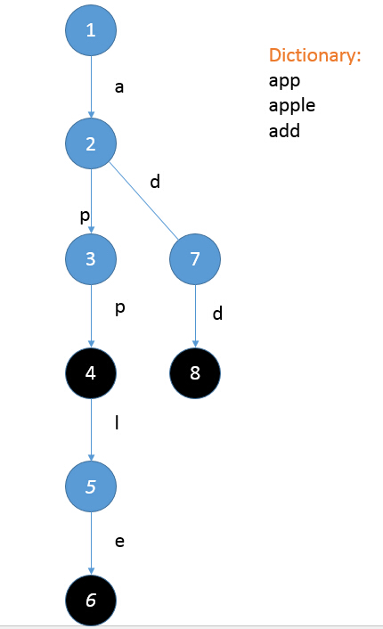
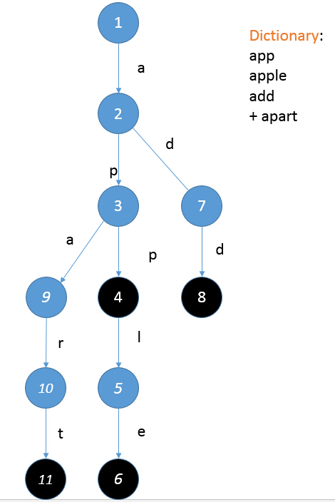

## 提示一：Trie树的建立
小Hi于是在纸上画了一会，递给小Ho，道：“你看这棵树和这个词典有什么关系？”

小Ho盯着手里的纸想了一会道：“我知道了！对于从树的根节点走到每一个黑色节点所经过的路径，如果将路径上的字母都连起来的话，就都对应着词典中的一个单词呢！”

小Hi说道：“那你知道如何根据一个词典构建这样一棵树么？”

“不造！”

“想你也不知道，我来告诉你吧~”小Hi摆出一副老师的样子，说道：“你先这么想，如果我已经有了这样的一个词典和对应的一棵树，我要添加一个新的单词apart，我应该怎么做？”

“让我想想……”小Ho又开始苦思冥想：“首先我要先看看已经能走到哪一步了对吧？比如我从1号节点走"a"这一条边就可以走到2号节点，然后从2号节点走"p"这一条边可以走到3号节点，然后……就没路可走了！这时候我就需要添加一条从3号节点出发且标记为"p"的边才可以接着往下走……最后就是这样了！然后我把最后到达的这个结点标记为黑色就可以了。”

小Hi说道：“真聪明~那你不妨再算算如果是一个有10W个单词的词典，每个单词的长度不超过10的话，这棵树会有多大？”

小Ho于是掏出笔来，一边画一遍念叨：“假设我已经将前三个单词构成了这样一棵树，那么我要添加一个新的单词的时候，最坏情况是这个单词和之前的三个单词都没有公共前缀，那么这个新的单词的长度如果是5的话，我就至少要添加5个结点到树中才能够继续表示这个词典！”

“而如果每次都是最坏情况的话，这棵树最多也就100W个结点这么大！更何况最坏情况是不可能次次都发生的！毕竟字母表也才26个字母呢！”小Ho继续说道。

“嗯~这样我们是不是就可以用（单词个数*单词长度）个结点来表示一个词典了呢？小Hi问道。

“是的呢！”小Ho道：“但是这样一棵树又有什么用呢？”

“可别小看了它，它就是传说中的Trie树哦~至于他有什么用，一会你就知道了！”小Hi笑嘻嘻的回答道。