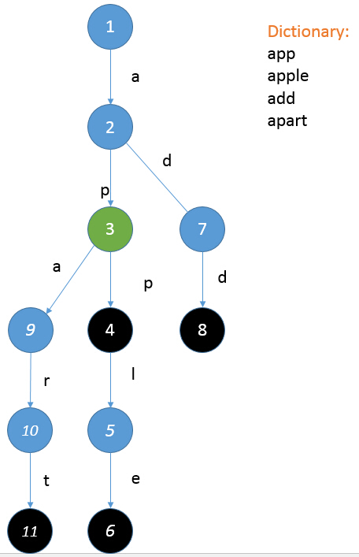

## 提示二：如何使用Trie树
小Hi在树上用绿色标出了一个节点，递给小Ho。

“这个结点……是从根节点先走"a"然后走"p"到达的结点呢！哦~~我知道了，以这个结点为根的子树里所有标记结点都是以"ap"为前缀的单词呢！而且所有以"ap"为前缀的单词都在以这个节点为根的子树里~”小Ho惊喜道。

“是的呢~那你对怎么解决我的问题有想法了么？”小Hi追问道。

“唔...那就是每次拿到你的字符串之后，我在树上找到其对应的那个结点，然后统计这个节点中有多少个标记节点？”小Ho不是很确定的答道：“但是这样...似乎在最坏情况，也就是你每次给个字符串都很短的时候，我还是要扫描这棵树的很大一部分呢？也就是说虽然平均时间复杂度降低了，但是最坏情况时间复杂度还是很高的样子！”

小Hi笑嘻嘻道：”没想到你自己看出来了呢~我还以为又要教训你了！~那你有什么好的解决方法么？”

“没呢！小Hi你就别卖关子了，赶紧告诉我吧！”被折磨的够呛的小Ho开始求饶。

“好吧！就帮你这一回~”

[返回](./1014%20-%20Trie树.md)